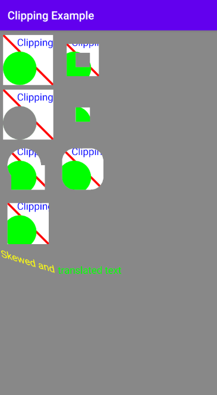

# Android-Clipping-Canvas-Objects
A simple app to show how to use clipping combined with other shapes to achieve different effects and to prevent overdraw.

- In the above example the top left shape is the original shape and all other shapes are made by clipping different regions (to make them unavailable for drawing) and then drawing that original shape on top the that clipped region. 
- The spatial transformations for each drawing has been achieved by translating/skewing the canvas object itself and then restoring it afterwards.